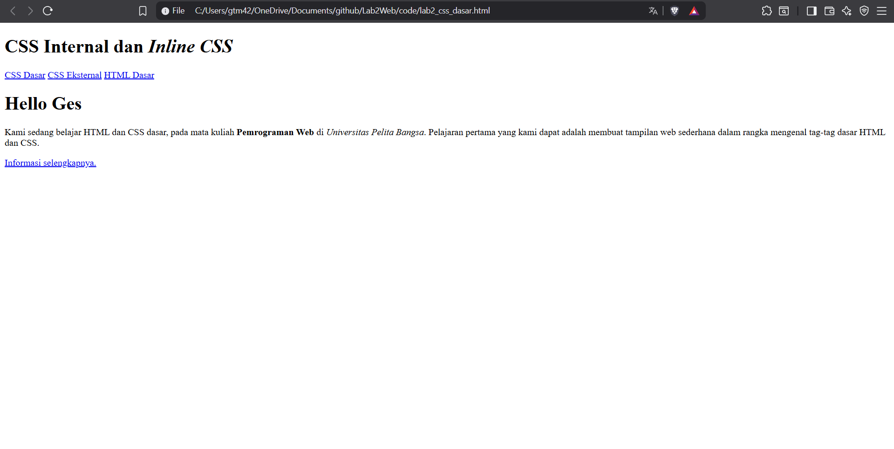
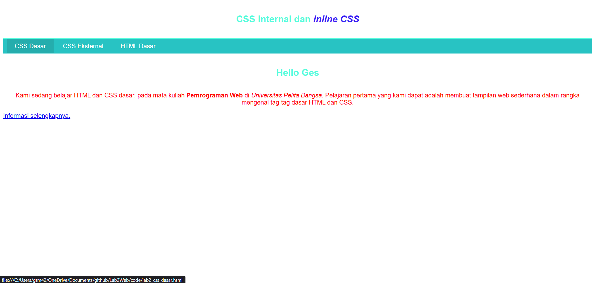
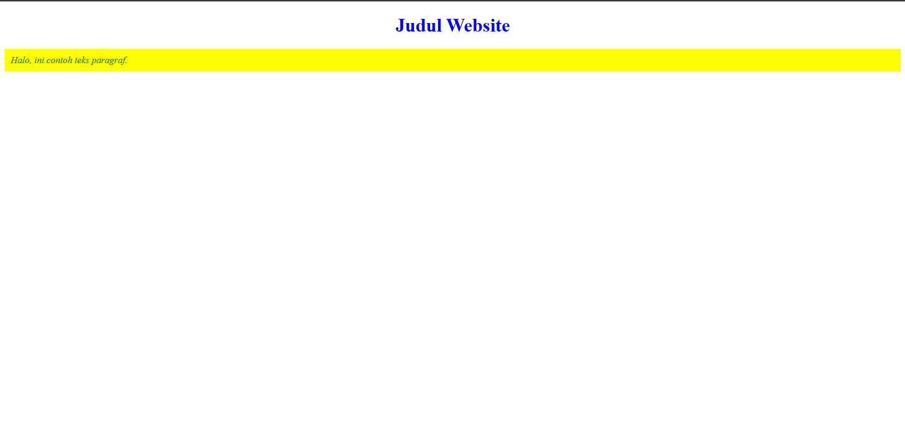

### Nama : Albhani Fadillah Haryady
### NIM : 312410130
### kelas : TI 24 A 1

# Praktikum
## 1. Membuat Dokumen HTML Pertama
kita mulai dengan bikin file HTML sederhana:
```html
<!DOCTYPE html>
<html lang="en">
<head>
  <meta charset="UTF-8">
  <meta name="viewport" content="width=device-width, initial-scale=1.0">
  <title>CSS Dasar</title>
</head>
<body>
  <header>
    <h1>CSS Internal dan <i>Inline CSS</i></h1>
  </header>

  <nav>
    <a href="lab2_css_dasar.html">CSS Dasar</a>
    <a href="lab2_css_eksternal.html">CSS Eksternal</a>
    <a href="lab1_tag_dasar.html">HTML Dasar</a>
  </nav>

  <!-- CSS ID Selector -->
  <div id="intro">
    <h1>Hello World</h1>
    <p>
      Kami sedang belajar HTML dan CSS dasar, pada mata kuliah
      <b>Pemrograman Web</b> di <i>Universitas Pelita Bangsa</i>.
      Pelajaran pertama yang kami dapat adalah membuat tampilan web
      sederhana dalam rangka mengenal tag-tag dasar HTML dan CSS.
    </p>
    <!-- CSS Class Selector -->
    <a class="button btn-primary" href="#intro">Informasi selengkapnya.</a>
  </div>
</body>
</html>
```


## 2. Mendeklarasikan CSS Internal
Kemudian tambahkan deklarasi CSS internal seperti berikut pada bagian head dokumen.
```html
<title>CSS Dasar</title>
<style>
        body {
              font-family:'Open Sans', sans-serif;
        }
    header {
              min-height: 80px;
              border-bottom:1px solid #55fcdd;
        }
      h1 {
           font-size: 24px;
            color: #55fcdd;
            text-align: center;
            padding: 20px 10px;
        }
        h1 i {
            color:#361df4;
        }
</style>
```


## 3. Menambahkan Inline CSS
Kemudian tambahkan deklarasi inline CSS pada tag `<p>` seperti berikut:
```html
<p style="text-align: center; color: #ff0000;">
```


## 4. Membuat CSS Eksternal
Buat file baru dengan nama `style_eksternal.css` kemudian buatlah deklarasi CSS seperti berikut:
```css
nav {
    background: #28c3c3;
    color:#fff;
    padding: 10px;
}
nav a {
    color: #fff;
    text-decoration: none;
    padding:10px 20px;
}
nav .active,
nav a:hover {
    background: #25adad;
}

```
Kemudian tambahkan tag `<link>` untuk merujuk file css yang sudah dibuat pada bagian `<head>`
```html
<head>
<!-- menyisipkan css eksternal -->
<link rel="stylesheet" href="style_eksternal.css" type="text/css">
```


## 5. Menambahkan CSS Selector
Selanjutnya menambahkan CSS Selector menggunakan ID dan Class Selector. Pada file
`style_eksternal.css`, tambahkan kode berikut:
```css
/* ID Selector */
#intro {
    background: #0f13ff;
    border: 1px solid #06237a;
    min-height: 100px;
    padding: 10px;
}
#intro h1 {
    text-align: center;
    border: 0;
    color: #fff;
}
/* Class Selector */
.button {
    padding: 15px 20px;
    background: #bebcbd;
    color: #fff;
    display: inline-block;
    margin: 10px;
    text-decoration: none;
}
.btn-primary {
    background: #ff0cb2;
}
```


# Pertanyaan dan Tugas
1. Lakukan eksperimen dengan mengubah dan menambah properti dan nilai pada kode CSS
dengan mengacu pada CSS Cheat Sheet yang diberikan pada file terpisah dari modul ini.

Test CSS
```html
<!DOCTYPE html>
<html lang="en">
<head>
    <meta charset="UTF-8">
    <meta name="viewport" content="width=device-width, initial-scale=1.0">
    <title>Judul Halaman</title>
    <link rel="stylesheet" href="a.css">
</head>
<body>
<h1>Judul Website</h1>
<p id="paragraf-1" class="text-paragraf">Halo, ini contoh teks paragraf.</p>
</body>
</html>
```


```css
h1 {
  color: blue;         /* warna teks biru */
  font-size: 32px;     /* ukuran font */
  text-align: center;  /* rata tengah */
}

.text-paragraf {
  color: green;        /* warna teks hijau */
  font-style: italic;  /* miring */
}

#paragraf-1 {
  background-color: yellow; /* background kuning */
  padding: 10px;            /* jarak dalam */
}

```


2. Apa perbedaan pendeklarasian CSS elemen `h1 {...}` dengan `#intro h1 {...}`? berikan
penjelasannya!
- `h1 {…} → berlaku untuk semua elemen <h1> di halaman.`

- `#intro h1 {…} → berlaku hanya untuk <h1> yang berada di dalam elemen dengan ID intro.`
contoh:
```html
<h1>Judul Global</h1>
<div id="intro">
  <h1>Judul di dalam Intro</h1>
</div>
```
```css
h1 { color: blue; }
#intro h1 { color: red; }
```

3. Apabila ada deklarasi CSS secara internal, lalu ditambahkan CSS eksternal dan inline CSS pada
elemen yang sama. Deklarasi manakah yang akan ditampilkan pada browser? Berikan
penjelasan dan contohnya!
- Urutan prioritasnya:
- Inline CSS (di atribut `style`) → paling kuat.
- Internal CSS (tag `<style>` di `<head>`) → menengah. Eksternal CSS (file `.css`) → terendah (tapi tetap bisa override kalau ditulis paling akhir).
contoh:
```html
<head>
  <link rel="stylesheet" href="style.css"> <!-- Eksternal -->
  <style>
    p { color: green; }  /* Internal */
  </style>
</head>
<body>
  <p style="color:red;">Teks ini</p> <!-- Inline -->
</body>

```
Jika di style.css ada:
```css
p { color: blue; }
```

4. Pada sebuah elemen HTML terdapat ID dan Class, apabila masing-masing selector tersebut
terdapat deklarasi CSS, maka deklarasi manakah yang akan ditampilkan pada browser?
Berikan penjelasan dan contohnya! `( <p id="paragraf-1" class="text-paragraf"> )`

Jika sebuah elemen memiliki ID dan Class, maka:

- ID (`#id`) lebih spesifik daripada Class (`.class`), sehingga CSS dengan ID akan menang.
- Inline CSS akan tetap paling tinggi kalau ada.
Contoh:
```html
<p id="paragraf-1" class="text-paragraf">Halo Dunia</p>
```
```css
.text-paragraf { color: blue; }
#paragraf-1 { color: red; }
```
Hasilnya: teks merah, karena ID lebih kuat.


Kalau ditambah inline:
```html
<p id="paragraf-1" class="text-paragraf" style="color:green;">Halo Dunia</p>
```
Hasilnya: teks hijau, karena inline paling kuat.